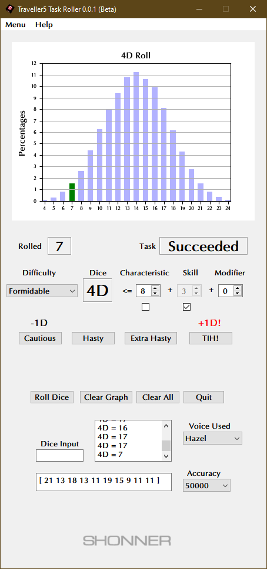
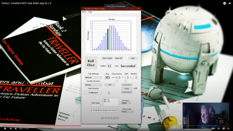
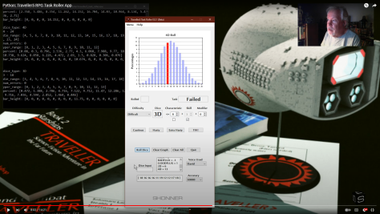

**Traveller5 RPG Task Roller for Python 3.11**
==============================================

**Traveller5 RPG Task Roller** is a Python 3.11 program for rolling various dice using PyQt5 and Matplotlib.

Some Things Required
--------------------

* **Windows 10**

  This code has not been tested on Windows 11.

* **Python 3.11.4**

  This code was written using Python 3.11.4.

* **PyQt5 5.15.9**

  PyQt5 is the framework used for displaying the Window GUI and buttons, etc.
   
* **numpy 1.25.0**

  For building arrays.

* **matplotlib 3.7.1**

  For graphics plotting.

* **pyttsx3 2.90**

  For the MS Zira and MS David voices (it will try to detect other SAPI voices installed).

What's in v0.1.0?
-----------------

	

What's in the Initial Release?
------------------------------

Don't Have Python?
------------------

The .EXE version can be run in Windows 10.

.. |ss| raw:: html

    <strike>

.. |se| raw:: html

    </strike>

Things To-Do
------------

| Instruction manual.
| Cheat codes.
|ss|

| Add Task Duration settings.
| Add more things to Clear All.
| Fix Tool Tips.
| Start on a To-Do.

|se|

**Known History**

* v0.1.6b

  **Clear Roll History** button added.

* v0.1.5b

  Selecting GUI style now available.

* v0.1.1b

  Not every thing would disable when beta expired.

* v0.1.0b

  Added Variable Duration. Can be used as an option.
  Logging added to most features.

* v0.0.2b

  (Optional) Fate rolls were using the wrong random(). Fixed.
  Cautious, Hasty, Extra Hasty buttons now toggle each other on/off.
  Clear All clears more stuff.
  Updated Tool Tips.
  Computer now speaks die roll input.

* v0.0.1b

  Initial release.

Contact
-------
Questions? Please contact shawndriscoll@hotmail.com
