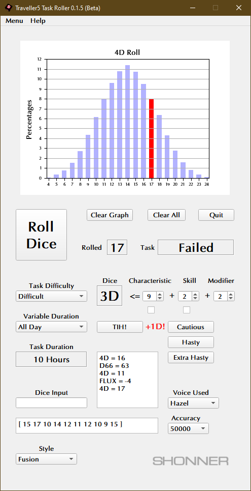
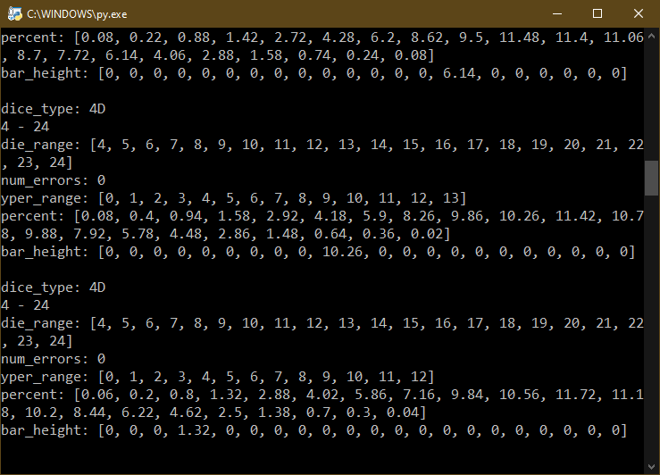

**Traveller5 RPG Task Roller for Python 3.11**
==============================================

**Traveller5 RPG Task Roller** is a Python 3.11 program for rolling various dice using PyQt5 and Matplotlib.

Some Things Required
--------------------

* **Windows 11**

  This code will still run on Windows 10.

* **Python 3.11**

  This code was written using Python 3.11.6.

* **PyQt5 5.15.9**

  PyQt5 is the framework used for displaying the Window GUI and buttons, etc.
   
* **numpy 1.26.0**

  For building arrays.

* **matplotlib 3.8.0**

  For graphics plotting.

* **pyttsx3 2.90**

  For the MS Zira and MS David voices (it will try to detect other SAPI voices installed).
  
* **Fonts**

  Simply install the fonts found in the fonts folder.

What's in v0.1.0?
-----------------

.. image:: images/video2.png
    :target: https://www.youtube.com/watch?v=argU12wFpEc
	

What's in the Initial Release?
------------------------------

Don't Have Python?
------------------

The .EXE version can be run in Windows 11 and 10.

.. |ss| raw:: html

    <strike>

.. |se| raw:: html

    </strike>

Things To-Do
------------

| Instruction manual.
| Cheat codes.
|ss|

| Add Task Duration settings.
| Add more things to Clear All.
| Fix Tool Tips.
| Start on a To-Do.

|se|

**Known History**

* v0.3.1b

  Changing the Characteristic, Skill, or Modifier values now clears the graph.

* v0.3.0b

  Critical success and failure results are now possible.

* v0.2.1b

  **Cautious**, **Hasty**, and **Extra Hasty** buttons now reset properly.

* v0.2.0b

  Now uses pydice 3.13.0.

* v0.1.9b

  Increased accuracy to 500,000 iterations.
  Reports the mean average of rolls if applicable.

* v0.1.8b

  Updated for Windows 11. Will still run on Windows 10.
  The **Clear Roll History** button wasn't clearing new fields recently added.
  Rolls can't be made until a target number is determined.

* v0.1.7b

  Fixed crash caused when the amount of high or low number of dice to keep was missing.

* v0.1.6b

  **Clear Roll History** button added.

* v0.1.5b

  Selecting GUI style now available.

* v0.1.1b

  Not every thing would disable when beta expired.

* v0.1.0b

  Added Variable Duration. Can be used as an option.
  Logging added to most features.

* v0.0.2b

  (Optional) Fate rolls were using the wrong random(). Fixed.
  Cautious, Hasty, Extra Hasty buttons now toggle each other on/off.
  Clear All clears more stuff.
  Updated Tool Tips.
  Computer now speaks die roll input.

* v0.0.1b

  Initial release.

Contact
-------
Questions? Please contact shawndriscoll@hotmail.com
